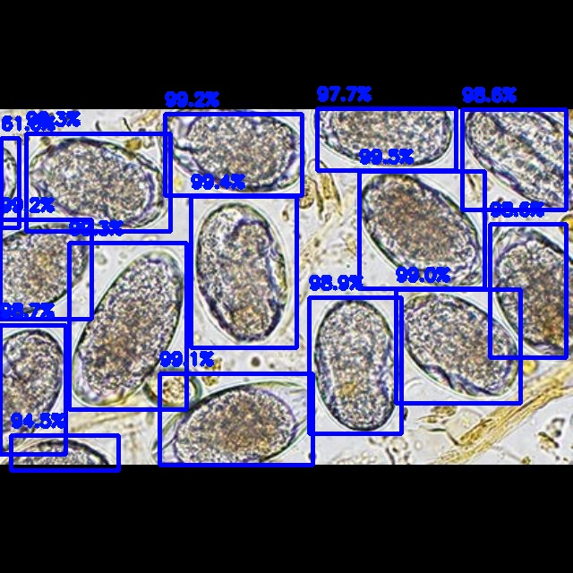

# Parasite Egg Detection

**Microscopic Analysis and Detection of Parasitic Eggs in Human and Ruminant Fecal Samples Using Deep Learning**

This repository contains code for detection algorithms designed to identify and classify parasitic eggs in microscopic images of human and ruminant fecal samples. The project includes two algorithms: one designed for human fecal samples and another for ruminants, the latter of which also calculates fecal egg count (FEC) to assess infestation levels. This approach aims to significantly reduce both the time and cost associated with traditional methods.

## Project Description

_Frameworks and Tools: PyTorch, Flask, AWS, Nvidia NGC, Docker_

This project aims to automate the detection and classification of parasitic eggs in microscopic images of fecal samples, significantly reducing the time and cost associated with traditional methods. Manual detection, while effective, is both labor-intensive and expensive. For instance, identifying strongylid eggs in ruminants — a process that can take up to two weeks and cost $30 per sample — highlights the inefficiency of traditional approaches.

The project encompasses two algorithms: one designed for detecting fecal eggs in humans and another for ruminants. The human-focused algorithm leverages a fine-tuned version of Torchvision's Faster R-CNN model, featuring a 12-unit output layer that identifies 11 classes of parasitic eggs plus one class indicating no eggs. When provided with a microscopic image, the algorithm outputs a new image annotated with bounding boxes around detected eggs, along with their corresponding classes and confidence scores as shown below:


The second algorithm, designed for ruminants, fine-tunes the initial model with a 2-unit output layer to specifically detect the presence of strongylid eggs. Despite the use of a smaller dataset, this approach effectively enables the model to generalize features of fecal eggs while focusing on the unique characteristics of strongylid eggs in ruminants. Upon inputting an image, the algorithm outputs the fecal egg count (FEC), eggs per gram, and the infestation level of the ruminant. Additionally, it generates a new image annotated with bounding boxes around detected eggs, along with their corresponding confidence scores as shown below:



In the Flask web application, two images are fed into the algorithm, and the fecal egg count is averaged across them to mirror the Modified McMaster Test traditionally used in laboratory settings for fecal egg counting.

## Results

Overview:

- Human Fecal Egg Detection Model: mAP@0.5: 0.9372, mAP@0.5-0.95: 0.7681 for 440 test set images
- Ruminant Fecal Egg Detection Model: mAP@0.5: 0.9302, mAP@0.5-0.95: 0.6172 for 25 test set images

The specific results of the detection models are documented in the following files:

- Human Fecal Egg Detection Model: references/general_model_results.txt
- Ruminant Fecal Egg Detection Model: references/strongylid_model_results.txt

## Project Logistics

The detection algorithms are stored under parasite_egg_detection/.

- data/: Holds the image datasets and the Dataset class for PyTorch.
- saved_models/: Stores all saved models and their descriptions, saved using PyTorch.
- load_data.py: Preprocess data and prepare DataLoaders in PyTorch.
- general_model.py: Handles model loading, fine-tuning, training, and saving for the human fecal egg detection model.
- strongylid_model.py: Similar to general_model.py, but for the ruminant fecal egg detection model.
- test_performance.py: Evaluates model performance using metrics such as precision, recall, and mean Average Precision (mAP).
- evaluate.py: Contains the calculations for precision and recall scores.
- redict.py: Loads the finalized model and runs inference on input images.
- s3_to_ec2.sh: Script for transferring the IEEE dataset from AWS S3 to an EC2 instance.

Flask web application:

- app.py: The main application file for the Flask web app.
- static/: Contains static files such as CSS and images.
- templates/: Stores HTML templates for the web application.

A Dockerfile is included to containerize the application for consistent deployment across various environments.

references/ includes EC2 commands for training integration, a typical Faster R-CNN architecture structure for reference, and performance results for both the human fecal egg detection model (general model) and the ruminant fecal egg detection model (strongylid model).

## How to Install and Run

Follow these steps to install and run the project:

1. Clone this repository to your local machine using the following command:

```bash
git clone https://github.com/dhshin04/Parasite-Egg-Detection.git
```

2. Install necessary dependencies through the following command:

```bash
pip install -r requirements.txt
```

3. Import dataset from the [IEEE Dataset](https://ieee-dataport.org/competitions/parasitic-egg-detection-and-classification-microscopic-images#files).

To run the Docker image containing the detection models, do the following and visit localhost:5000:

```bash
docker build -t myapp:latest .
docker run -p 5000:5000 myapp:latest
```

## How to Contribute

This project can benefit from the addition of larger datasets, particularly for strongylid egg detection, as well as experimentation with alternative model architectures, such as YOLO and Mask R-CNN (if the dataset permits). Contributions in these areas could significantly enhance the model's accuracy and generalization. If you'd like to contribute to this project, please follow these steps:

1. Fork the repository.
2. Create a new branch for your feature or bug fix.
3. Make your changes and commit them with descriptive commit messages.
4. Push your changes to your fork.
5. Submit a pull request to the main repository.

## Credits

Author: Donghwa Shin [GitHub](https://github.com/dhshin04)

This project builds upon a similar earlier effort, Eggs by the Dozen ([GitHub Repository](https://github.com/3amBEANS/EggsByTheDozen)), which aimed to detect strongylid eggs using pre-defined feature engineering techniques instead of a neural network. While the approach showed potential, it faced major limitations in accuracy, which this current project aims to overcome through deep learning.

IEEE Dataset used for training:
[N. Anantrasirichai, T. H. Chalidabhongse, D. Palasuwan, K. Naruenatthanaset, T. Kobchaisawat, N. Nunthanasup, K. Boonpeng, X. Ma and A. Achim, "ICIP 2022 Challenge on Parasitic Egg Detection and Classification in Microscopic Images: Dataset, Methods and Results," IEEE ICIP2022.](https://arxiv.org/abs/2208.06063)

## Future Improvements

A larger dataset, especially for strongylid egg detection, could help better train the model and improve performance. Furthermore, a larger test set could help better assess model performance and identify any issues involving underfitting or overfitting.

Exploring alternative model architectures, such as YOLO (You Only Look Once) or Mask R-CNN, could further enhance detection and classification performance. Currently, the IEEE dataset includes only bounding box annotations, which limits the use of Mask R-CNN. However, if mask data were included, Mask R-CNN could be employed to improve instance segmentation and achieve better accuracy.
